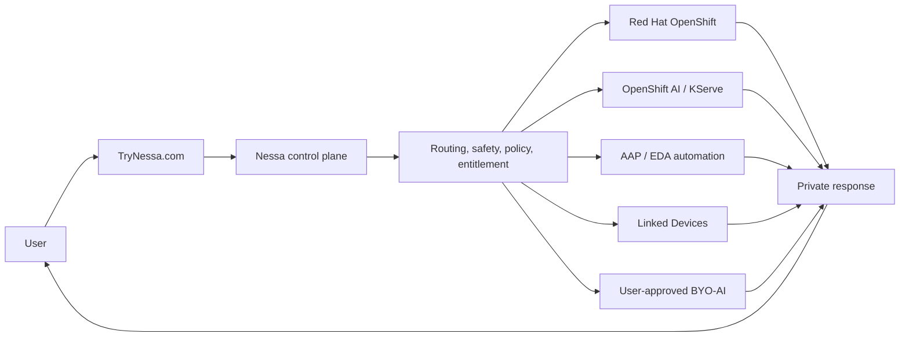

# Nessa AI Reference Architecture

Private family-focused AI platform patterns using Red Hat OpenShift, OpenShift AI, OpenShift Virtualization, Ansible Automation Platform, Event-Driven Ansible, Strix Halo, and Apple Silicon.

This repository shares the architecture patterns, validation discipline, and platform lessons behind Nessa AI. It does not publish the TryNessa.com product source code or private implementation details.

Nessa AI is a private family-focused AI platform built around a simple principle: AI should help people learn, protect private work, and use user-controlled compute where possible.

## What This Repo Is

This is the public reference architecture for Nessa AI / TryNessa.com.

It documents:

- platform patterns that worked in a real OpenShift environment
- Red Hat product integration across OpenShift, OpenShift AI, OpenShift Virtualization, AAP, EDA, and ODF/Ceph
- private-AI inference lane design across cluster GPU, CPU fallback, Apple Silicon Linked Devices, and BYO-AI concepts
- validation discipline, staging-before-production release habits, browser proof expectations, and exact-digest promotion mindset
- public-safe family AI, Learning, OCR/vision, Linked Devices, and NessaClaw boundary patterns
- sanitized lessons from running a private AI product on real hardware

## What This Repo Is Not

This is not the TryNessa.com product source code.

It intentionally does not publish:

- Secure Connector internals, pairing flows, protocols, tunnel mechanics, job schemas, or token handling
- tenant logic, production account flows, billing logic, user records, or private analytics
- private routing heuristics, premium model-selection rules, prompt chains, or product-specific safety bypass details
- Learning / Homework Buddy lesson-flow logic, worksheet parsers, anti-cheat behavior, or proprietary tutor-state mechanics
- live OpenShift topology, real route names, hostnames, IP addresses, credentials, database rows, configmaps, secrets, or private screenshots
- full NessaClaw execution recipes, tenant manifests, gateway tokens, raw OpenClaw access, or high-risk tool enablement steps

Public docs explain what was built, why it was built, what was validated, and what tradeoffs were learned. They do not expose the exact private recipe, connector internals, user data, routing heuristics, secrets, credentials, private network details, or proprietary Learning/Homework Buddy flows.

## Current Architecture Snapshot

The production product has evolved beyond the original CPU-first cluster. Current public-safe architecture themes include:

- OpenShift as the application, data, and operations platform
- OpenShift AI and KServe as model-serving and validation building blocks
- A dedicated Strix Halo lane for local accelerated inference experiments and OpenShift-hosted serving
- Apple Silicon Linked Devices, including M3 Max as an earlier reference and M5 Max with 128 GB unified memory as the current high-memory private compute lane
- fail-closed privacy posture when a requested private route is unavailable
- NessaClaw as Nessa's guarded private agent-workspace surface over OpenClaw-compatible infrastructure
- family-safe Learning and Homework Buddy principles without exposing lesson-flow implementation

## Red Hat Technologies Used

- **Red Hat OpenShift**: platform foundation, routes, deployments, services, namespaces, operators, rollout discipline, and private application hosting.
- **Red Hat OpenShift AI**: model serving, KServe concepts, workbench and evaluation patterns, and model-lab validation.
- **Red Hat OpenShift Virtualization**: broader platform capability for VM workloads where private AI deployments need VM and container workloads side by side.
- **Red Hat Ansible Automation Platform**: operational automation, health snapshots, repeatable platform actions, and demo-friendly runbooks.
- **Event-Driven Ansible**: event-driven operations, release hooks, and alert or webhook response patterns.
- **ODF / Ceph**: durable storage patterns for platform state, document storage, workspace storage, and model-serving persistence.

Product names are used factually. This repository does not imply Red Hat endorsement of Nessa AI.

## Hardware and Inference Lanes

The reference architecture discusses several public-safe inference lanes:

- **OpenShift / Strix Halo lane**: cluster-side accelerated inference using a high-memory AMD Strix Halo class node.
- **Apple Silicon Linked Device lane**: private user-approved compute on Apple Silicon, with M3 Max as a prior reference and M5 Max 128 GB unified memory as the current high-memory reference.
- **CPU historical lane**: a useful baseline for understanding why acceleration and routing discipline matter.
- **BYO-AI lane**: user-controlled external providers, only by explicit user choice and never as a silent fallback when privacy forbids it.

Apple Silicon Linked Devices are not OpenShift workers or KServe pods. They are private linked compute endpoints governed by Nessa policy and user approval.

## Linked Devices and Private Compute

Linked Devices are a public-safe pattern for user-owned private compute:

- users approve whether a device participates
- the product should show health and readiness truthfully
- explicit selection should fail closed when unavailable
- premium or private labels must not silently fall back to a different route
- device and connector internals should not be published

See [docs/04-linked-devices-public-pattern.md](./docs/04-linked-devices-public-pattern.md) and [docs/05-secure-connector-public-boundary.md](./docs/05-secure-connector-public-boundary.md).

## NessaClaw / OpenClaw-Compatible Private Agent Workspaces

NessaClaw is Nessa's managed private agent-workspace product surface. It uses Nessa authentication, entitlement, policy, storage, audit, safety, and kill-switch controls around OpenClaw-compatible infrastructure.

Public positioning:

- use **NessaClaw** for the Nessa product name
- use **OpenClaw** only for technical/upstream attribution
- users interact with Nessa, not a raw OpenClaw route
- safe WebChat and read-only skills come first
- high-impact tools remain locked unless separately approved and validated

See [docs/09-nessaclaw-openclaw-compatible-workspaces.md](./docs/09-nessaclaw-openclaw-compatible-workspaces.md).

## Learning and Family Safety Principles

Learning / Homework Buddy is a core product pillar. Public docs describe the philosophy, not the proprietary implementation.

The public pattern is:

- teach, do not only answer
- guide step by step
- preserve age and family appropriateness
- support worksheets, photos, and documents with privacy-first routing where possible
- treat trust failures as P0 defects
- avoid publishing lesson-state schemas, prompt chains, parsers, anti-cheat logic, or tutor flow mechanics

See [docs/07-learning-and-family-safety.md](./docs/07-learning-and-family-safety.md) and [docs/FAMILY_AI_SAFETY_PATTERNS.md](./docs/FAMILY_AI_SAFETY_PATTERNS.md).

## Public-Safe Documentation Boundary

The short version:

- share ingredients, kitchen layout, safety rules, quality checks, and lessons learned
- do not share the secret recipe, proprietary timing, production credentials, full clone path, or commercially defensible implementation details

Start with [docs/00-public-scope-and-redactions.md](./docs/00-public-scope-and-redactions.md).

## Repo Map

Primary public reference docs:

- [docs/00-public-scope-and-redactions.md](./docs/00-public-scope-and-redactions.md)
- [docs/01-architecture-overview.md](./docs/01-architecture-overview.md)
- [docs/02-red-hat-stack.md](./docs/02-red-hat-stack.md)
- [docs/03-inference-lanes.md](./docs/03-inference-lanes.md)
- [docs/04-linked-devices-public-pattern.md](./docs/04-linked-devices-public-pattern.md)
- [docs/05-secure-connector-public-boundary.md](./docs/05-secure-connector-public-boundary.md)
- [docs/06-byo-ai-public-pattern.md](./docs/06-byo-ai-public-pattern.md)
- [docs/07-learning-and-family-safety.md](./docs/07-learning-and-family-safety.md)
- [docs/08-ocr-ai-vision-public-pattern.md](./docs/08-ocr-ai-vision-public-pattern.md)
- [docs/09-nessaclaw-openclaw-compatible-workspaces.md](./docs/09-nessaclaw-openclaw-compatible-workspaces.md)
- [docs/10-validation-and-release-discipline.md](./docs/10-validation-and-release-discipline.md)
- [docs/11-contributing.md](./docs/11-contributing.md)
- [docs/12-license-and-attribution.md](./docs/12-license-and-attribution.md)

Diagrams:

- [docs/diagrams/nessa-reference-architecture.md](./docs/diagrams/nessa-reference-architecture.md)
- [docs/diagrams/inference-lanes.md](./docs/diagrams/inference-lanes.md)
- [docs/diagrams/linked-devices-pattern.md](./docs/diagrams/linked-devices-pattern.md)
- [docs/diagrams/nessaclaw-boundary.md](./docs/diagrams/nessaclaw-boundary.md)

Supplemental sanitized historical docs and examples:

- `docs/03-core-only-phase.md` through `docs/13-cost-analysis.md`
- `docs/FAMILY_AI_SAFETY_PATTERNS.md`
- `examples/openshift`
- `examples/aap`
- `examples/notebooks`

## Contributing

Useful contributions include docs improvements, diagrams, benchmark-harness improvements, public-safe Red Hat/OpenShift patterns, sanitized examples, and typo fixes.

Do not submit secrets, private topology, production configuration, account data, connector internals, raw route dumps, customer screenshots, bypass techniques, or requests to expose proprietary product logic.

See [docs/11-contributing.md](./docs/11-contributing.md).

## License and Attribution

This repository is licensed under the Apache License 2.0. It covers only the public-safe reference architecture materials, examples, diagrams, and documentation in this repository.

It does not publish or license the private TryNessa.com product source code, Secure Connector internals, production configuration, tenant logic, private routing heuristics, account flows, proprietary Learning/Homework Buddy implementation, secrets, credentials, or private infrastructure.

OpenClaw is upstream/open-source technology; NessaClaw is Nessa's guarded product integration and does not imply ownership of upstream OpenClaw. Preserve upstream license notices if any OpenClaw MIT-licensed material is copied or adapted.

Red Hat, OpenShift, OpenShift AI, OpenShift Virtualization, Ansible Automation Platform, Event-Driven Ansible, and related marks are trademarks of Red Hat, Inc. Product names are used factually.

See [docs/12-license-and-attribution.md](./docs/12-license-and-attribution.md).

## Security / Responsible Disclosure

Do not open public issues with secrets, private route names, user data, connector tokens, authentication material, exploit details, or bypass recipes.

For sensitive reports, contact the maintainer privately through the channels listed on the public Nessa sites.

## Links

- [TryNessa.com](https://TryNessa.com)
- [NessaAi.com](https://NessaAi.com)
- [NessaBot.com](https://NessaBot.com)
