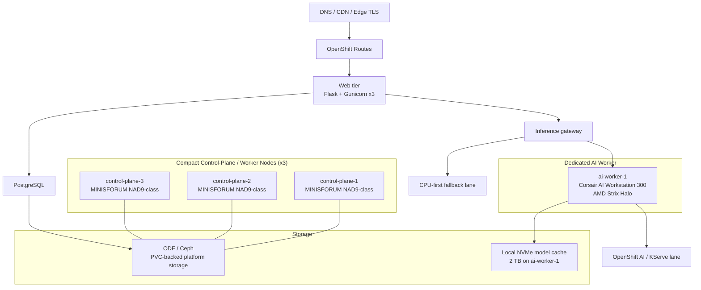

# Core-Based OpenShift for Private AI Applications
## A Production Reference Architecture by PRIORITYmicro

### Executive Summary
This repository documents a private AI application that started on a compact, CPU-first, bare-metal OpenShift cluster and later crossed into genuinely useful low-latency inference by adding a single AMD Strix Halo worker. The result was a practical production reference architecture rather than a lab demo: PostgreSQL replaced SQLite, streaming became smooth enough for real users, OpenShift rollouts stayed disciplined, and one dedicated AI worker changed the platform from “it technically works” to “people will actually use it.” The measured deltas were large enough to matter. First-token latency dropped from roughly `4-10s` to `0.3-0.7s`, a 2-page story dropped from `27.9s` to `7.3s`, and the system moved from a fragile `2-3` concurrent heavy users to a realistic `15-30` user operating envelope.

### Key Results
| Metric | Before (CPU-only) | After (Strix Halo) | Improvement |
|--------|-------------------|---------------------|-------------|
| Story generation (2 pages) | 27.9s | 7.3s | 3.8x faster |
| Research paper | 19.6s | 12.3s | 1.6x faster |
| Email draft | 2.97s | 1.99s | 1.5x faster |
| Technical document | 28.0s | 24.5s | 1.1x faster |
| Bootstrap time | 6-32s | 42-94ms | 300x faster |
| Concurrent users supported | 2-3 | 15-30 | 10x more |
| Models available | 3B only | 3B-14B+ | 5x range |
| GPU inference (tok/s) | 0 (CPU only) | 135-150 tok/s | new capability |
| First token latency | 4-10s | 0.3-0.7s | 14x faster |
| Database backend | SQLite | PostgreSQL | enterprise-grade |

### Architecture Overview

### Table of Contents
- [Who This Is For](#who-this-is-for)
- [Hardware Specifications](#hardware-specifications)
- [Quick Start](#quick-start)
- [Repository Map](#repository-map)
- [About](#about)
- [docs/01-repo-scope-and-redactions.md](./docs/01-repo-scope-and-redactions.md)
- [docs/02-reference-architecture.md](./docs/02-reference-architecture.md)
- [docs/03-core-only-phase.md](./docs/03-core-only-phase.md)
- [docs/04-application-patterns-on-openshift.md](./docs/04-application-patterns-on-openshift.md)
- [docs/05-openshift-ai-and-aap.md](./docs/05-openshift-ai-and-aap.md)
- [docs/06-adding-a-strix-halo-worker.md](./docs/06-adding-a-strix-halo-worker.md)
- [docs/07-lessons-learned.md](./docs/07-lessons-learned.md)
- [docs/08-next-hardware-options.md](./docs/08-next-hardware-options.md)
- [docs/09-operations-checklist.md](./docs/09-operations-checklist.md)
- [docs/10-known-constraints.md](./docs/10-known-constraints.md)
- [docs/11-benchmark-results.md](./docs/11-benchmark-results.md)
- [docs/12-architecture-diagrams.md](./docs/12-architecture-diagrams.md)
- [docs/13-cost-analysis.md](./docs/13-cost-analysis.md)
- [examples/openshift/README.md](./examples/openshift/README.md)
- [examples/aap/README.md](./examples/aap/README.md)
- [examples/notebooks/README.md](./examples/notebooks/README.md)

### Who This Is For
- OpenShift operators running AI workloads in a home lab or small data center footprint
- Engineers evaluating CPU-first AI before buying dedicated accelerators
- Teams planning their first serious AI worker without rebuilding the entire platform
- Architects who want production patterns, tradeoffs, failure modes, and operational reality instead of toy demos

### Hardware Specifications
**Compact Control-Plane Nodes (x3)**
- Platform: MINISFORUM NAD9-class mini PC
- CPU: Intel Core i9-12900H (`14C/20T`)
- RAM: `64 GB` per node
- Storage: local NVMe for OS plus ODF-attached storage for persistent platform services
- Network: shared `1 GbE`
- Role: control-plane + lightweight worker
- Cost: `~$450-650` each depending on RAM and storage

**Dedicated AI Worker (x1)**
- Platform: Corsair AI Workstation 300
- CPU: AMD Ryzen AI Max+ 395 (`16C/32T`)
- GPU: integrated Radeon `gfx1151` / RDNA 3.5 class graphics
- RAM: `128 GB` LPDDR5x-8000 unified memory
- Storage: `2 x 2 TB` NVMe Gen 4
- GPU memory behavior: roughly `62 GB` usable GTT in the validated CoreOS driver path with low UMA still set in BIOS
- Network: `2.5 GbE`
- Role: primary AI inference worker, GPU-accelerated serving lane, local model cache host
- Cost: `~$2,800`

### Quick Start
1. Read [docs/01-repo-scope-and-redactions.md](./docs/01-repo-scope-and-redactions.md) to understand what is intentionally generalized.
2. Read [docs/02-reference-architecture.md](./docs/02-reference-architecture.md) for the cluster, storage, routing, and TLS layout.
3. Read [docs/03-core-only-phase.md](./docs/03-core-only-phase.md) before buying accelerators. It explains what CPU-first can and cannot do.
4. Read [docs/04-application-patterns-on-openshift.md](./docs/04-application-patterns-on-openshift.md) for the deployment, route, SSE, PVC, and rollout patterns that mattered most.
5. Read [docs/06-adding-a-strix-halo-worker.md](./docs/06-adding-a-strix-halo-worker.md) before adding an AI worker. That is the most important hardware integration document in this repo.
6. Review [docs/11-benchmark-results.md](./docs/11-benchmark-results.md), [docs/12-architecture-diagrams.md](./docs/12-architecture-diagrams.md), and [docs/13-cost-analysis.md](./docs/13-cost-analysis.md) if you need numbers for planning or stakeholder conversations.
7. Use the sanitized examples under `examples/openshift`, `examples/aap`, and `examples/notebooks` as adaptation templates, not copy-paste production manifests.
8. Use [docs/09-operations-checklist.md](./docs/09-operations-checklist.md) as the daily and weekly runbook.

### Repository Map
- `docs/01-repo-scope-and-redactions.md`: sanitization rules and what is intentionally excluded
- `docs/02-reference-architecture.md`: detailed topology, networking, storage, inference, and database design
- `docs/03-core-only-phase.md`: what the CPU-only stage felt like, where it worked, and where it broke down
- `docs/04-application-patterns-on-openshift.md`: deployment, readiness, PVC, ConfigMap, Secret, route, and scaling patterns
- `docs/05-openshift-ai-and-aap.md`: how KServe and AAP fit into a real private AI platform
- `docs/06-adding-a-strix-halo-worker.md`: the dedicated AI-worker integration guide with benchmark deltas and tuning reality
- `docs/07-lessons-learned.md`: the mistakes, surprises, and operating truths
- `docs/08-next-hardware-options.md`: realistic upgrade-path analysis for 2026 hardware
- `docs/09-operations-checklist.md`: daily, weekly, monthly operations commands and checks
- `docs/10-known-constraints.md`: honest limitations and tradeoffs
- `docs/11-benchmark-results.md`: representative production measurements with methodology notes
- `docs/12-architecture-diagrams.md`: Mermaid diagrams you can reuse in presentations and internal docs
- `docs/13-cost-analysis.md`: hardware and monthly operating cost comparisons
- `examples/openshift`: sanitized manifests showing the most reusable OpenShift patterns
- `examples/aap`: a small Ansible Automation Platform workflow for operational snapshots
- `examples/notebooks`: a simple notebook-oriented demo flow for OpenShift AI environments

### About
This repository is maintained by Matt Faust as part of the PRIORITYmicro project portfolio. It documents real infrastructure patterns from a private AI platform running on bare-metal OpenShift.

- [PRIORITYmicro](https://www.prioritymicro.com) - parent project
- Built with Red Hat OpenShift Container Platform
- AI inference accelerated with AMD Strix Halo hardware

© 2026 Matt Faust / PRIORITYmicro - Licensed under MIT
