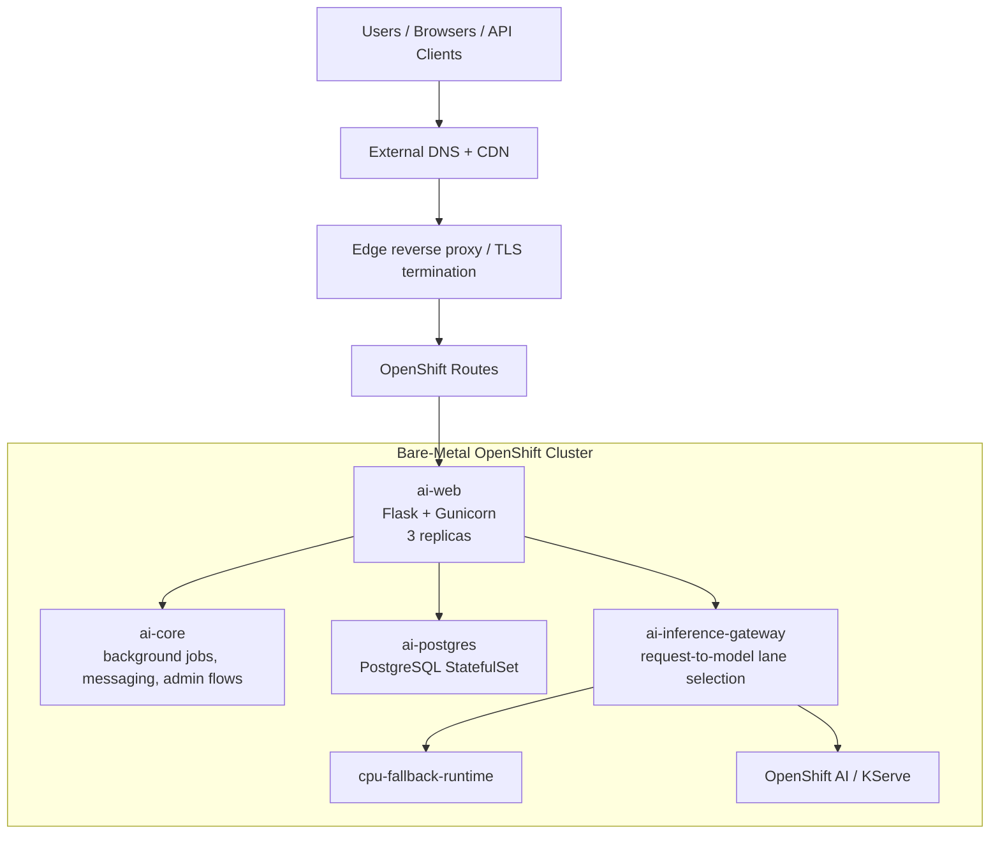

# Reference Architecture

## Overview
The architecture documented here is the result of running a private AI application on a compact bare-metal OpenShift cluster first, then adding a single dedicated AI worker when CPU-first inference stopped being good enough. That matters because the platform did not start with premium AI hardware. It grew into it.

The architecture has four major layers:
- edge ingress and TLS
- stateless application services
- stateful data and storage services
- inference and model-serving lanes

## High-Level Topology

## Node Roles
### Compact Control-Plane / Worker Nodes (x3)
These nodes carried:
- the OpenShift control plane
- routine cluster operators
- PostgreSQL and application state
- web/API replicas
- background workloads
- ODF/Ceph storage roles

This was a cost-effective way to start, but it came with consequences:
- control-plane headroom mattered every day
- sloppy app limits showed up as cluster risk, not just app inefficiency
- storage and inference experiments had to be separated intentionally

### Dedicated AI Worker (x1)
The dedicated AI worker carried:
- GPU-accelerated inference
- heavier `llama.cpp` or KServe-serving workloads
- local model cache on NVMe
- AI-specific node placement rather than general platform services

That worker was explicitly not used as a storage anchor.

In the current public hardware story, this worker is represented by a Strix Halo / AMD Ryzen AI Max+ 395 class system with 128 GB unified memory. It was chosen because it could become a real OpenShift worker and carry local inference under the same platform discipline as the rest of the environment.

### Apple Silicon Linked Device
The Apple Silicon lane is intentionally separate from the OpenShift worker lane.

It carried:
- private user-approved local compute
- OCR and AI Vision workflows
- MLX / Metal model experiments
- private image workflows
- GPT-OSS 120B class high-memory testing

The current high-memory public reference is a MacBook Pro M5 Max with 128 GB unified memory. It is not treated as an OpenShift worker. It is a private Linked Device with readiness checks and fail-closed route behavior.

The two high-memory systems are complementary:
- Strix Halo is the cluster-serving worker.
- M5 Max is the private Apple Silicon endpoint.
- Thunderbolt 5 / USB4 direct sideband makes lab artifact movement and validation work faster without becoming a blanket product-routing rule.

## Network Topology
At a high level, traffic followed this path:
1. A public DNS and CDN layer resolved the public application name.
2. TLS terminated at the edge and/or at the OpenShift route boundary depending on the specific endpoint.
3. OpenShift routes forwarded traffic into the web tier.
4. The web tier owned auth, UX, API behavior, request classification, and response streaming.
5. The inference layer only handled model execution.

This separation mattered. It kept the application understandable even while inference hardware and serving backends changed.

## DNS and Edge Pattern
A practical pattern for this kind of deployment is:
- public DNS managed at the edge provider
- a small reverse-proxy or edge layer handling public traffic and certificate policy
- OpenShift routes owning internal cluster ingress and health semantics

Why this worked:
- OpenShift stayed responsible for route health and pod readiness
- the edge could handle public DNS, caching, and certificate convenience
- the application could evolve without re-architecting the public entry point

## Storage Architecture
Storage had two distinct roles.

### 1. Platform persistence
ODF/Ceph across the compact nodes provided:
- PostgreSQL PVCs
- durable application state
- route and deployment safety during routine restarts
- enough resilience for a small but real production service

### 2. Local AI-worker model cache
A dedicated NVMe volume on the AI worker provided:
- local GGUF and model artifact storage
- lower cold-start overhead for heavier models
- reduced dependency on remote or container-image-bound model artifacts

The lesson was simple: cluster storage and model-cache storage are different problems. Treat them differently.

## Database Layer
The application started with SQLite and later moved to PostgreSQL.

That migration changed the platform materially:
- bootstrap latency collapsed from seconds to milliseconds
- concurrent writes stopped fighting single-writer locks
- app health became easier to reason about
- restarts became less dramatic under load

In this architecture, PostgreSQL is the system of record. It is not an optional add-on.

## Web Tier
The web tier used a Flask-style application with Gunicorn and multiple replicas.

Key decisions that mattered:
- thread-capable workers instead of purely synchronous workers
- readiness and health checks tuned for SSE-style traffic
- rolling updates with explicit verification after each rollout
- separation between user-facing request logs and background keepalive noise

The web tier should remain stateless wherever possible. Persist state in PostgreSQL, not in pod-local files.

## Inference Routing at a High Level
This repo intentionally does not publish the proprietary routing logic of the private application, but the high-level pattern is still useful:
1. the app classifies the prompt class and urgency
2. the gateway chooses the best serving lane available
3. small/simple work can stay on lighter or CPU-based lanes
4. deeper or longer work can move to the dedicated AI worker or KServe lane
5. a CPU fallback remains available when the preferred lane is unavailable

That model keeps the platform resilient. AI acceleration becomes an upgrade path, not a single point of failure.

## TLS Pattern
TLS was treated as a layered concern:
- external certificates at the edge where appropriate
- route-level TLS inside OpenShift
- internal service-to-service traffic protected by cluster networking and namespace boundaries

This is not the only possible pattern, but it is a practical one for a small bare-metal cluster.

## Why This Architecture Was Effective
This architecture worked because it respected sequencing:
- first make the platform stable
- then make the database durable
- then improve inference latency
- then add AI-serving specialization

That order prevented hardware decisions from masking platform weaknesses.
