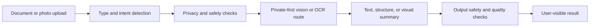

# OCR and AI Vision Public Pattern

## Purpose

This document describes public-safe OCR and AI Vision architecture patterns for Nessa AI. It does not publish bypass details, classifier thresholds, hidden prompts, exact OCR repair heuristics, or private user content.

## Intake Pattern

Public-safe flow:

## Privacy Principles

- Use private routes where possible.
- Treat family, child, and school content as sensitive.
- Avoid exposing raw uploaded content in logs or public docs.
- Keep document identity, account identity, and private route detail out of public examples.
- Make failures honest when OCR or vision confidence is weak.

## AI Vision Safety Pattern

Useful public layers:

- input file validation
- document or photo classification
- private-first routing
- extraction or description
- output safety review
- user-visible uncertainty where needed

For generated images, public lessons include:

- no-people-by-default can reduce hidden unsafe output risk for scenery, object, vehicle, pet, food, and interior prompts
- prompt safety is not enough by itself
- output safety and asset binding matter before display
- unsafe prompts should block before generator use

## Redaction Pattern

Before publishing OCR or vision examples:

- remove user names, emails, and account IDs
- remove children or family details
- remove real documents unless explicitly public
- remove route names and storage IDs
- remove private image outputs unless fully sanitized

## What Is Not Published

This repo does not publish:

- safety bypass details
- raw classifier thresholds
- exact OCR repair heuristics
- hidden prompts
- image-generation guard internals
- real family, child, or user content
- private generated image examples
- document IDs or storage paths
