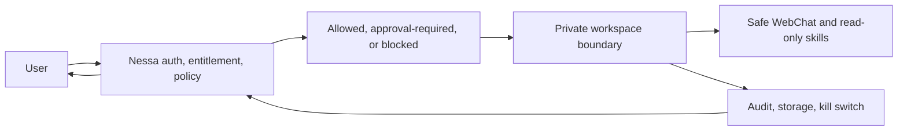

# NessaClaw and OpenClaw-Compatible Workspaces

## Purpose

This document explains NessaClaw in public-safe terms.

NessaClaw is Nessa's guarded private agent-workspace surface.

OpenClaw is an upstream open-source project. Nessa references it plainly and does not claim ownership of it.

Upstream link: https://github.com/openclaw/openclaw

## Naming

Use:

- **NessaClaw** for the Nessa product surface
- **OpenClaw** for the upstream project
- **OpenClaw-compatible infrastructure** for the compatibility layer

Do not imply that Nessa owns upstream OpenClaw.

## Public-Safe Product Model

NessaClaw is private agent workspaces powered by Nessa guardrails and OpenClaw-compatible infrastructure.

The user interacts with Nessa:

## Current Public Truth

The public docs may describe the current canary posture:

- owner/admin canary first
- Nessa is the control plane
- no raw public OpenClaw route
- user never talks directly to raw OpenClaw
- isolated workspace model
- safe WebChat and read-only skills first
- high-impact tools locked
- audit, kill switch, and storage controls are part of the product boundary

## Guardrail Model

Nessa decides whether an agent task is:

- allowed
- approval-required
- blocked
- unavailable

High-impact categories stay locked unless separately designed, approved, and validated.

Examples of high-impact categories:

- shell or real machine access
- browser form submission
- purchases or payments
- email or external messaging sends
- Smart Home control
- file deletion or destructive workflows

## OpenClaw Attribution

OpenClaw is an open-source project.

NessaClaw is Nessa's guarded product layer around Nessa auth, policy, storage, audit, safety, and workspace controls.

If any OpenClaw-derived code, manifests, docs, or examples are copied or adapted into this repo, preserve upstream copyright and MIT license notices.

## What Is Not Published

This repo does not publish:

- full tenant manifests
- exact deployment engine code
- gateway tokens
- tenant IDs
- live namespace object dumps
- private canary instance IDs
- raw route exposure
- direct task execution recipes
- high-risk tool enablement steps
- secrets or provider credentials
