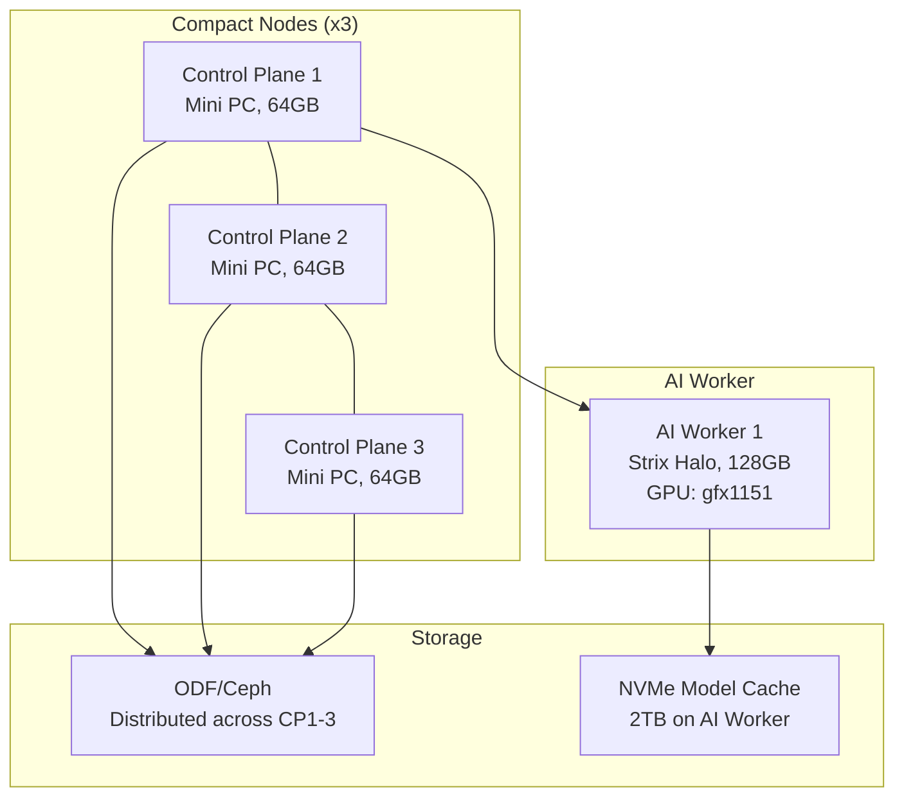
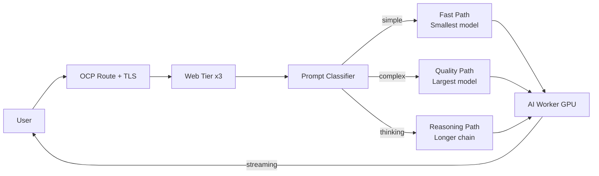
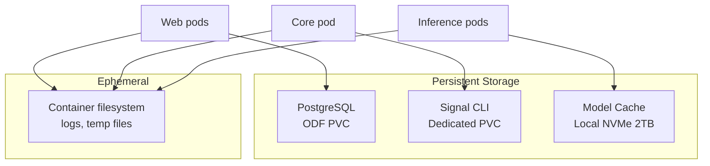
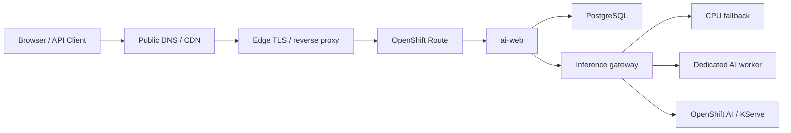
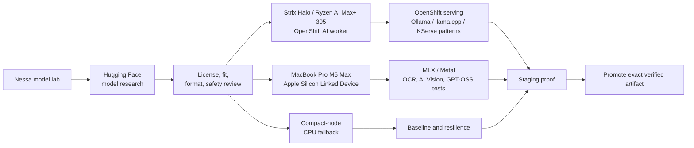
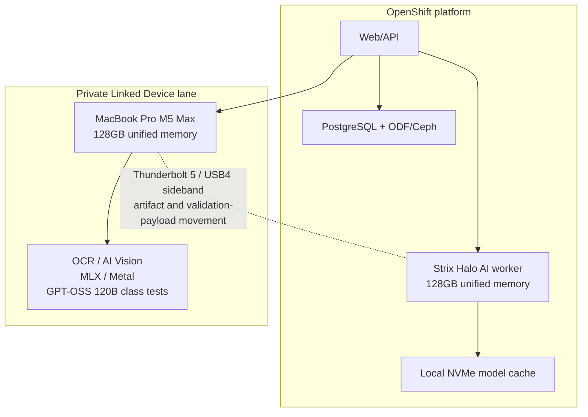

# Architecture Diagrams

These diagrams are sanitized and intentionally generic, but they are based on the real reference architecture documented in this repository.

## 1. Cluster topology

## 2. Inference routing

## 3. Storage architecture

## 4. Edge to application path

## 5. Hardware and model lab

## 6. Strix Halo and M5 Max roles

