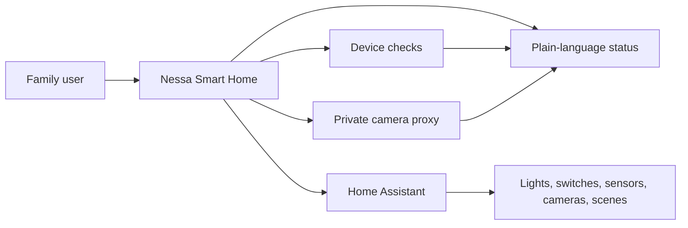

# Smart Home and Home Assistant

Nessa Smart Home is built for real households, not lab demos.

The goal is simple:

- show whether the home is healthy
- keep cameras and core devices easy to check
- explain problems in plain language
- use safe controls only when the user has configured them
- keep credentials and private endpoints out of the browser

## Why Home Assistant

Home Assistant is one of the strongest open-source smart-home projects in the world. It already understands a wide range of devices, hubs, automations, cameras, sensors, lights, switches, fans, scenes, scripts, and buttons.

Nessa uses Home Assistant where practical instead of pretending every device integration should be built from scratch. Home Assistant source and API behavior are reviewed as upstream open-source project material; Home Assistant source code is not republished in this reference repo.

Public upstream links:

- Home Assistant website: https://www.home-assistant.io/
- Home Assistant GitHub organization: https://github.com/home-assistant
- Home Assistant Core: https://github.com/home-assistant/core
- Home Assistant REST API docs: https://developers.home-assistant.io/docs/api/rest/

## Nessa Smart Home Pattern

Nessa sits above home infrastructure as a calm status and action layer.

What Nessa adds:

- a one-glance `House right now` answer before any grid of cards
- one household status surface
- simple health checks for routers, Pi-hole, NAS, websites, cameras, and Home Assistant entities
- Home Assistant import for supported entity types
- private camera snapshot and live-view paths through a Nessa proxy
- plain-language summaries for parents and non-technical family members
- safe action boundaries

## The House Right Now Pattern

The front door should answer one household question before showing any dials:

- `All good`
- `Needs a look`
- `Something's down`

The line under that state should be plain language, generated from the same readiness data the detail cards already use. That keeps the experience honest and avoids turning a status dashboard into another AI chat request.

The detailed device grid can still be powerful. The calmer pattern is to group it into a few obvious sections:

- Internet
- Devices
- Services

This keeps routers, core network checks, cameras, Home Assistant entities, and service health available without making the first screen feel like a network operations console.

## What We Keep Locked

Smart Home should feel powerful without becoming reckless.

Nessa does not publish private home topology, camera URLs, tokens, account IDs, hostnames, IP addresses, or exact action recipes in this public repo.

High-risk controls stay locked unless they are separately designed, approved, and validated.

Examples:

- unlock doors
- open garage doors
- disable security devices
- make purchases
- run arbitrary scripts
- expose raw camera URLs or hub tokens to the browser

## Public-Safe Lesson

The best smart-home AI is not the one with the most buttons.

It is the one that tells the family what matters, keeps private systems private, and only acts when the action is clear, safe, and authorized.
