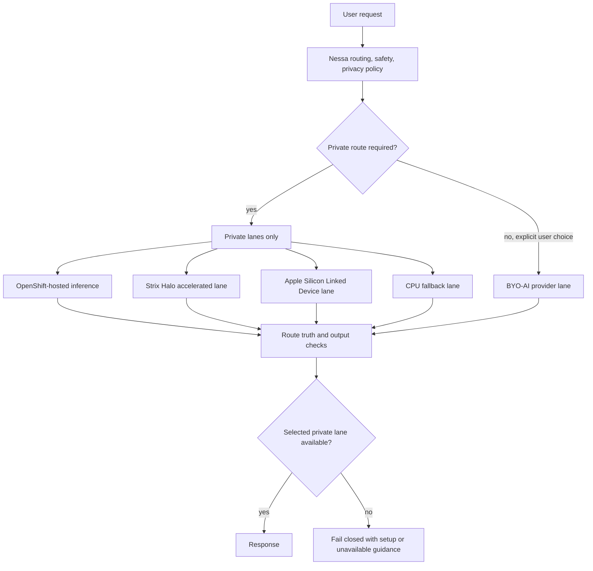

# Inference Lanes Diagram

This diagram shows lane categories only. It intentionally omits routing scores, private model lists, hardware IDs, live route names, and connector internals.

```mermaid
flowchart TB
  Request["User request"] --> Policy["Nessa routing, safety, privacy policy"]
  Policy --> PrivateReq{"Private route required?"}
  PrivateReq -->|yes| PrivateLanes["Private lanes only"]
  PrivateReq -->|no, explicit user choice| BYO["BYO-AI provider lane"]

  PrivateLanes --> OCP["OpenShift-hosted inference"]
  PrivateLanes --> Strix["Strix Halo accelerated lane"]
  PrivateLanes --> Apple["Apple Silicon Linked Device lane"]
  PrivateLanes --> CPU["CPU fallback lane"]

  OCP --> Gate["Route truth and output checks"]
  Strix --> Gate
  Apple --> Gate
  CPU --> Gate
  BYO --> Gate

  Gate --> Available{"Selected private lane available?"}
  Available -->|yes| Response["Response"]
  Available -->|no| Closed["Fail closed with setup or unavailable guidance"]
```
