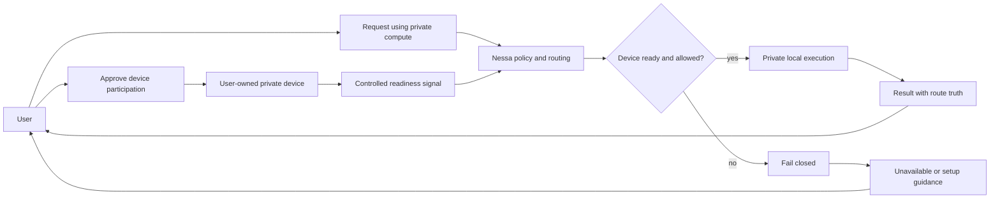

# Linked Devices Pattern Diagram

This diagram is a product-level pattern. It does not describe Secure Connector protocol, pairing, token exchange, heartbeat schema, job payloads, or transport mechanics.

