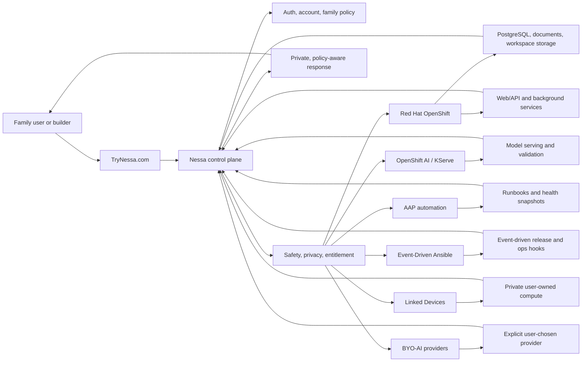

# Nessa Reference Architecture Diagram

This diagram is public-safe. It contains no private IPs, no internal hostnames, no account identifiers, and no Secure Connector protocol details.

```mermaid
flowchart LR
  User["Family user or builder"] --> Public["TryNessa.com"]
  Public --> Control["Nessa control plane"]
  Control --> Auth["Auth, account, family policy"]
  Control --> Safety["Safety, privacy, entitlement"]
  Safety --> OCP["Red Hat OpenShift"]
  Safety --> RHOAI["OpenShift AI / KServe"]
  Safety --> AAP["AAP automation"]
  Safety --> EDA["Event-Driven Ansible"]
  Safety --> Devices["Linked Devices"]
  Safety --> BYO["BYO-AI providers"]

  OCP --> Data["PostgreSQL, documents, workspace storage"]
  OCP --> Web["Web/API and background services"]
  RHOAI --> Models["Model serving and validation"]
  AAP --> Ops["Runbooks and health snapshots"]
  EDA --> Events["Event-driven release and ops hooks"]
  Devices --> Private["Private user-owned compute"]
  BYO --> External["Explicit user-chosen provider"]

  Data --> Control
  Web --> Control
  Models --> Control
  Ops --> Control
  Events --> Control
  Private --> Control
  External --> Control
  Control --> Response["Private, policy-aware response"]
  Response --> User
```
