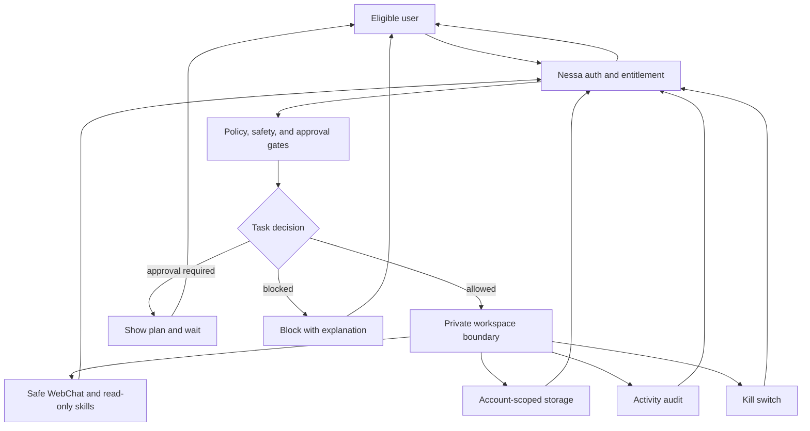

# NessaClaw Boundary Diagram

This diagram shows the public-safe NessaClaw boundary. It does not expose tenant manifests, tokens, raw gateway routes, private canary IDs, or high-risk tool enablement recipes.

